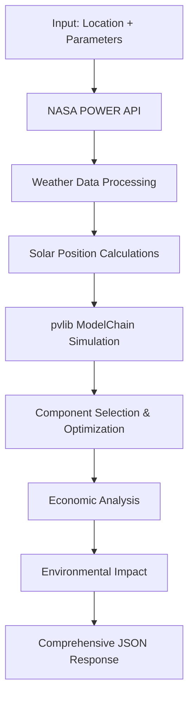

# � Indian PV System Energy Calculator v2.0

A comprehensive FastAPI-based solar photovoltaic (PV) system energy calculator designed specifically for the Indian market. This system provides detailed energy calculations, economic analysis, and environmental impact assessments for solar installations across India.

## 🚀 Features

### Core Functionality
- **Real-time Solar Calculations**: Uses NASA POWER API for weather data and pvlib-python for precise solar modeling
- **Indian Market Focus**: Realistic component databases with Indian solar modules and inverters
- **Budget Optimization**: Smart component selection based on budget constraints
- **Brand Preferences**: Support for preferred manufacturer selection
- **Comprehensive Analysis**: 15+ JSON response sections with 100+ data points

### Technical Capabilities
- **Weather Data Integration**: NASA POWER API with 4 key parameters (solar irradiance, temperature, humidity, wind speed)
- **Solar Position Modeling**: Advanced solar position calculations using pvlib DISC model
- **PV System Simulation**: Complete ModelChain simulation pipeline
- **Economic Projections**: 25-year financial analysis with ROI calculations
- **Environmental Impact**: Carbon footprint reduction calculations

### 🔆 **Realistic Indian Components**
- **Modules**: Adani, Waaree, Vikram, Tata Power, Jinko, Trina, Longi, REC, Canadian Solar, Panasonic
- **Inverters**: Sungrow, FIMER, Delta, ABB, SMA, Huawei, Enphase, Growatt, Fronius, Hitachi
- **Technologies**: Monocrystalline PERC, TOPCon, Bifacial, HJT

## � System Requirements

- **Python**: 3.8 or higher
- **Operating System**: Windows/Linux/macOS
- **Memory**: 4GB RAM minimum, 8GB recommended
- **Storage**: 500MB for dependencies + data files
- **Internet**: Required for NASA POWER API access

## 🛠️ Installation

### 1. Clone the Repository
```bash
git clone https://github.com/yourusername/indian-pv-calculator.git
cd indian-pv-calculator
```

### 2. Create Virtual Environment
```bash
# Windows
python -m venv venv
venv\Scripts\activate

# Linux/macOS
python3 -m venv venv
source venv/bin/activate
```

### 3. Install Dependencies
```bash
pip install -r requirements.txt
```

### 4. Verify Installation
```bash
python test_api_v2.py
```

## 🚀 Quick Start

### 1. Start the Server
```bash
python main_v2.py
```
Server runs on: `http://localhost:8000`

### 2. API Documentation
- **Interactive Docs**: `http://localhost:8000/docs`
- **ReDoc**: `http://localhost:8000/redoc`

### 3. Basic API Usage
```python
import requests

# API endpoint
url = "http://localhost:8000/calculate_pv_system_v2"

# Request parameters
data = {
    "latitude": 11.0183,
    "longitude": 76.9725,
    "roof_area": 100,
    "budget": 500000,
    "panel_count": 20
}

# Send request
response = requests.post(url, json=data)
result = response.json()

print(f"Annual Energy: {result['energy_calculations']['annual_energy_kwh']} kWh")
print(f"System Cost: ₹{result['economic_analysis']['total_system_cost']}")
```

## � API Parameters

### Required Parameters
| Parameter | Type | Description | Example |
|-----------|------|-------------|---------|
| `latitude` | float | Location latitude (decimal degrees) | 11.0183 |
| `longitude` | float | Location longitude (decimal degrees) | 76.9725 |
| `roof_area` | float | Available roof area (m²) | 100 |

### Optional Parameters
| Parameter | Type | Default | Description |
|-----------|------|---------|-------------|
| `budget` | float | None | Budget constraint (₹) |
| `panel_count` | int | None | Specific panel count |
| `preferred_brands` | list | [] | Preferred manufacturer brands |
| `tilt_angle` | float | latitude | Panel tilt angle (degrees) |
| `azimuth_angle` | float | 180 | Panel azimuth angle (degrees) |

## �📡 API Endpoints

### Main Calculation Endpoint

**POST** `/calculate_pv_system_v2`

Calculate PV system performance with comprehensive analysis and budget optimization.

#### Request Body:
```json
{
  "latitude": 11.0183,
  "longitude": 76.9725,
  "roof_area": 100,
  "budget": 500000,
  "panel_count": 20,
  "preferred_brands": ["Adani", "Tata"],
  "tilt_angle": 25,
  "azimuth_angle": 180
}
```

## 📈 Response Structure

The API returns comprehensive JSON with 15+ sections:

```json
{
  "system_overview": { 
    "total_capacity_kw": 5.2, 
    "panel_count": 20,
    "total_roof_area_used": 45.6,
    "system_efficiency": 21.3
  },
  "weather_data": { 
    "avg_ghi": 5.8, 
    "avg_temperature": 28.5,
    "avg_wind_speed": 3.2,
    "data_source": "NASA POWER"
  },
  "energy_calculations": { 
    "annual_energy_kwh": 7800, 
    "monthly_breakdown": [...],
    "capacity_factor": 17.1,
    "specific_yield": 1500
  },
  "economic_analysis": { 
    "total_system_cost": 260000, 
    "payback_period_years": 6.2,
    "25_year_savings": 1250000,
    "roi_percentage": 18.5
  },
  "component_details": { 
    "selected_modules": [...], 
    "selected_inverters": [...],
    "cost_breakdown": {...}
  },
  "environmental_impact": { 
    "co2_reduction_tons_25yr": 62.5, 
    "trees_equivalent": 280,
    "fossil_fuel_avoided": 156000
  },
  "optimization_details": {...},
  "budget_analysis": {...},
  "performance_metrics": {...},
  "location_analysis": {...},
  "technical_specifications": {...},
  "maintenance_schedule": {...},
  "warranty_information": {...},
  "grid_integration": {...},
  "comparison_analysis": {...}
}
```

### Component Information

**GET** `/components/modules` - List available solar modules

**GET** `/components/inverters` - List available inverters

## 🔧 Workflow Overview



## 📁 Project Structure

```
indian-pv-calculator/
├── main_v2.py                           # Main FastAPI server v2.0
├── test_api_v2.py                      # Test client & examples
├── requirements.txt                     # Enhanced dependencies
├── README.md                           # This file
├── modules_india_realistic_sample.csv  # Solar modules database
├── inverters_india_realistic_sample.csv # Inverters database
├── energy_cal.ipynb                   # Jupyter analysis notebook
└── SETUP_GUIDE.md                     # Detailed setup instructions
```

## 🧪 Testing

### Run Test Suite
```bash
python test_api_v2.py
```

### Example Test Scenarios
- **Budget Constrained**: `budget=300000` with area optimization
- **Brand Preference**: `preferred_brands=["Tata", "Adani"]`
- **Panel Count**: `panel_count=15` for specific installations
- **Location Testing**: Various Indian cities and coordinates

## 💡 Usage Examples

### 1. Budget-Constrained System
```python
import requests

# Budget-optimized system design
payload = {
    "latitude": 28.6139,      # New Delhi
    "longitude": 77.2090,
    "roof_area": 80,
    "budget": 400000,         # ₹4 lakh budget
    "preferred_brands": ["Adani", "Tata"]
}

response = requests.post("http://localhost:8000/calculate_pv_system_v2", json=payload)
result = response.json()

print(f"System Cost: ₹{result['economic_analysis']['total_system_cost']}")
print(f"Annual Energy: {result['energy_calculations']['annual_energy_kwh']} kWh")
print(f"Payback Period: {result['economic_analysis']['payback_period_years']} years")
```

### 2. Specific Panel Count System
```python
# Design system with specific panel count
payload = {
    "latitude": 13.0827,      # Chennai
    "longitude": 80.2707,
    "roof_area": 60,
    "panel_count": 15,        # Specific panel requirement
    "tilt_angle": 15,         # Custom tilt for Chennai
    "azimuth_angle": 180      # South-facing
}

response = requests.post("http://localhost:8000/calculate_pv_system_v2", json=payload)
result = response.json()

print(f"Panel Count: {result['system_overview']['panel_count']}")
print(f"System Capacity: {result['system_overview']['total_capacity_kw']} kW")
```

### 3. Brand Preference Analysis
```python
# Compare different brand preferences
brands_to_test = [
    ["Adani", "Tata"],
    ["Jinko", "Longi"],
    ["Waaree", "Vikram"]
]

for brands in brands_to_test:
    payload = {
        "latitude": 12.9716,   # Bangalore
        "longitude": 77.5946,
        "roof_area": 100,
        "preferred_brands": brands
    }
    
    response = requests.post("http://localhost:8000/calculate_pv_system_v2", json=payload)
    result = response.json()
    
    selected_module = result['component_details']['selected_modules'][0]['model']
    cost = result['economic_analysis']['total_system_cost']
    print(f"Brands {brands}: {selected_module}, Cost: ₹{cost}")
```

### 4. Extract Module Count for External APIs
```python
# Method 1: Direct from response
module_count = result['system_overview']['panel_count']

# Method 2: Calculate from capacity
capacity_kw = result['system_overview']['total_capacity_kw']
module_wattage = result['component_details']['selected_modules'][0]['power_stc']
module_count = int(capacity_kw * 1000 / module_wattage)

# Method 3: From component details
modules = result['component_details']['selected_modules']
total_modules = sum(module['quantity'] for module in modules)

print(f"Module count for external API: {module_count}")
```

## 🔧 Configuration

### Environment Variables

- `API_HOST`: Server host (default: 0.0.0.0)
- `API_PORT`: Server port (default: 8000)

### Input Validation

- **Latitude**: -90 to 90 degrees
- **Longitude**: -180 to 180 degrees  
- **System Capacity**: 0.1 to 100 kW
- **Year**: 2020 to 2024
- **Tilt**: 0 to 90 degrees (optional)
- **Azimuth**: 0 to 360 degrees (optional)

## 📊 Data Sources

### Weather Data
- **Source**: NASA POWER API
- **Parameters**: Solar irradiance, temperature, humidity, wind speed
- **Coverage**: Global with 0.5° × 0.625° resolution
- **Years**: 1981-present climatology

### Component Databases
- **Solar Modules**: 50+ Indian manufacturers with realistic pricing
- **Inverters**: 30+ models with efficiency ratings and costs
- **Pricing**: Updated Indian market rates (₹/Wp)

## 🌍 Indian Market Features

- **Currency**: All calculations in Indian Rupees (₹)
- **Standards**: BIS and MNRE compliant components
- **Subsidies**: Central and state subsidy calculations
- **Climate**: Optimized for Indian weather patterns
- **Grid**: Indian electricity tariff structures

## 🌍 Supported Locations

The API works for any location in India with:
- Accurate weather data from NASA POWER
- Indian solar resource patterns
- Local climate considerations
- Technology-specific optimizations

## ⚡ Performance

- **Typical Response Time**: 30-60 seconds for full analysis
- **Optimization**: 60-120 seconds with orientation optimization
- **Weather Data**: 8,760 hourly data points per year
- **Accuracy**: Industry-standard pvlib calculations

## 🔄 API Workflow

1. **Input Validation**: Validate user parameters
2. **Weather Data**: Fetch NASA POWER meteorological data
3. **Component Selection**: Choose optimal Indian modules/inverters
4. **Orientation Optimization**: Find best tilt/azimuth (if enabled)
5. **Simulation**: Run comprehensive pvlib simulation
6. **Analysis**: Calculate performance and economic metrics
7. **Response**: Return detailed results with breakdowns

## 📝 Notes

- Requires internet connection for NASA POWER API
- Dataset files must be present in working directory
- Optimization increases computation time but improves accuracy
- All calculations use Indian-specific components and parameters

## 🤝 Contributing

This API provides comprehensive solar energy analysis specifically optimized for Indian conditions. Feel free to extend or customize for your specific requirements.

---

**🇮🇳 Built for India's Solar Future** ⚡